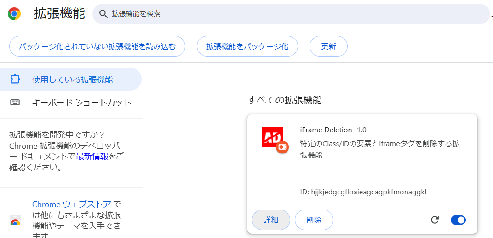
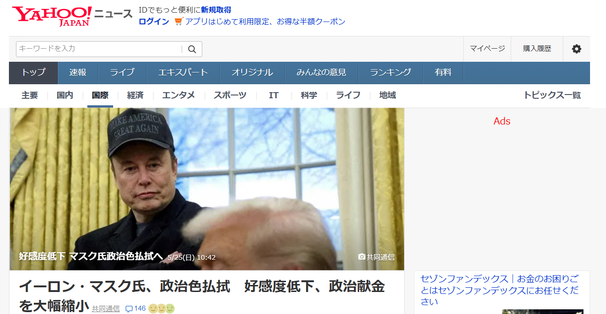
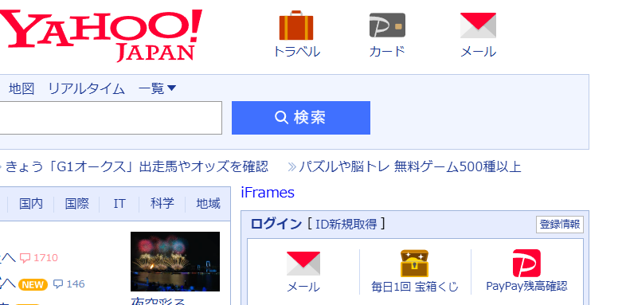

# RemoveUnwantedAds
不要な広告を削除するChrome拡張機能です

## インストール方法
Chromeウェブストアでは公開していないので、下記の手順で手動でインストールしてね

1. [Chrome拡張機能の設定画面](chrome://extensions/)を開く
1.「パッケージ化されていない拡張機能を読み込む」をクリック
1. cronしたこのリポジトリのフォルダを選択
1. 拡張機能がインストールされることを確認する

## 動作
削除した広告は削除されたことが分かるようにテキストを挿入するようにしています。
広告でよく使われているiframeタグも強制的に消すようにしています。広告じゃない部分も消しちゃってる可能性があるので注意。

